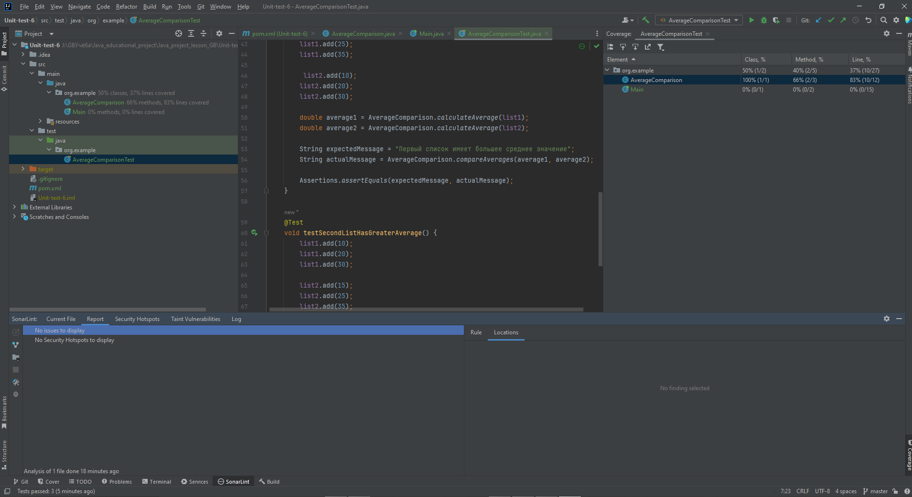
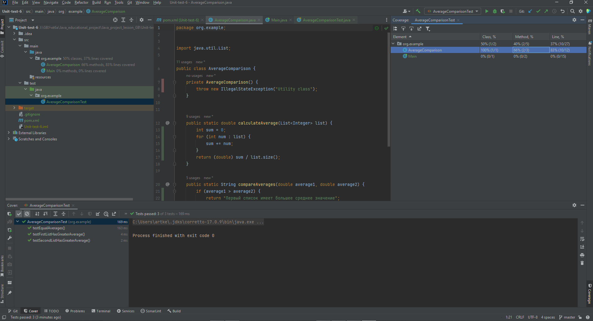

Есть три unit-теста, которые проверяют правильность работы метода `compareAverages` класса `AverageComparison`. 
Они покрывают различные сценарии использования и проверяют, 
что метод возвращает ожидаемые значения при сравнении средних значений.

